<p align="center">
  
</p>

<h1 align="center">TuneLog</h1>

<p align="center">좋아하는 음악과 감상평을 공유하는 음악 커뮤니티</p>

| 구분 | 주소 |
| --- | --- |
| 서비스 | [http://3.34.177.142](http://3.34.177.142) |
| Back-end 저장소 | [100-hours-a-week/KTB4_Justin_Week4](https://github.com/100-hours-a-week/KTB4_Justin_Week4) |

## Front-end 소개

- 좋아하는 음악과 감상평을 공유하는 음악 커뮤니티 서비스입니다.
- `React 19`와 `Vite`를 사용해 SPA(Single Page Application)로 구현했습니다.
- 곡명·가수·작성자 통합 검색, 자동완성, 장르 필터, 최신·인기 정렬을 하나의 게시글 화면에서 제공합니다.
- JWT Access Token을 이용해 로그인 상태를 관리하고 보호된 화면의 접근을 제어합니다.
- 반응형 레이아웃을 적용해 데스크톱과 모바일에서 사용할 수 있도록 구성했습니다.

### 개발 인원 및 기간

- 개발 기간: 2026.05 ~ 진행 중
- 개발 인원: 프론트엔드/백엔드 1명
- 개발자: [@shet6006](https://github.com/shet6006)

### 사용 기술 및 도구

| 구분 | 기술 |
| --- | --- |
| Core | React 19, JavaScript |
| Build | Vite 8 |
| Routing | React Router 7 |
| Styling | CSS |
| Web Server | Nginx |
| Deployment | Docker, Docker Compose, GitHub Actions, GHCR, AWS EC2 |

## 서비스 아키텍처

<p align="center">
  
</p>

## 주요 기능

### 인증과 사용자

```text
- 회원가입과 로그인
- JWT Access Token 기반 인증 상태 관리
- 인증이 필요한 경로 접근 제어
- 닉네임·프로필 이미지·비밀번호 수정
- 회원 탈퇴와 탈퇴 사용자 기본 프로필 처리
```

### 게시글

```text
- 음악 감상평 작성·조회·수정·삭제
- 곡명·가수·장르와 이미지 0~1장 등록
- 최신순·인기순 정렬
- 장르별 필터링
- 좋아요를 누른 게시글 모아보기
- 서버 페이지네이션과 페이지 전환 애니메이션
```

### 검색

```text
- 곡명·가수·작성자 통합 검색
- 300ms 디바운스를 적용한 검색어 자동완성
- 검색어와 장르·정렬·좋아요 필터 조합
- 적용된 검색어를 URL Query Parameter로 관리
- 검색 결과 건수와 현재 검색 상태 표시
```

### 댓글과 좋아요

```text
- 댓글 작성·조회·수정·삭제
- 댓글 10개 단위 서버 페이지네이션
- 게시글 좋아요 추가·취소
- 비로그인 상태에서 상호작용하면 로그인 안내
```

## 서비스 화면

### 게시글 탐색과 검색

<table>
  <tr>
    <td align="center"><strong>게시글 목록</strong></td>
    <td align="center"><strong>검색어 자동완성</strong></td>
  </tr>
  <tr>
    <td>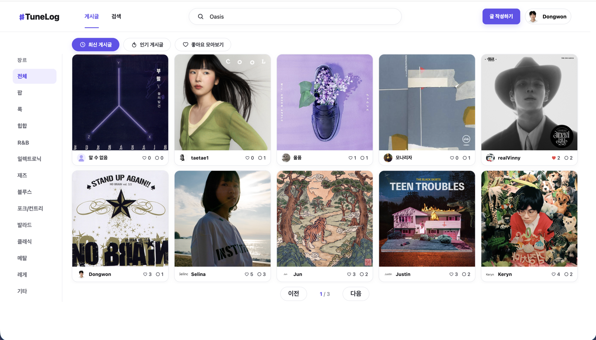</td>
    <td>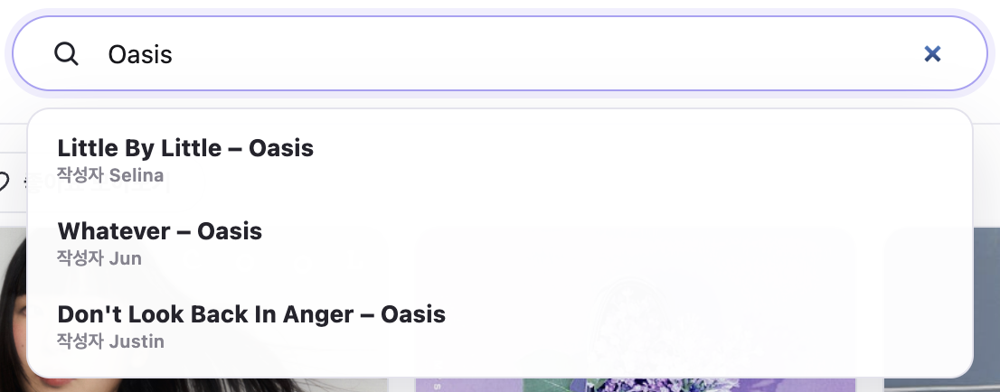</td>
  </tr>
  <tr>
    <td align="center"><sub>장르와 최신·인기 조건으로 게시글을 탐색합니다.</sub></td>
    <td align="center"><sub>곡명·가수·작성자를 기준으로 검색어를 추천합니다.</sub></td>
  </tr>
  <tr>
    <td align="center"><strong>검색 결과</strong></td>
    <td align="center"><strong>좋아요 모아보기</strong></td>
  </tr>
  <tr>
    <td>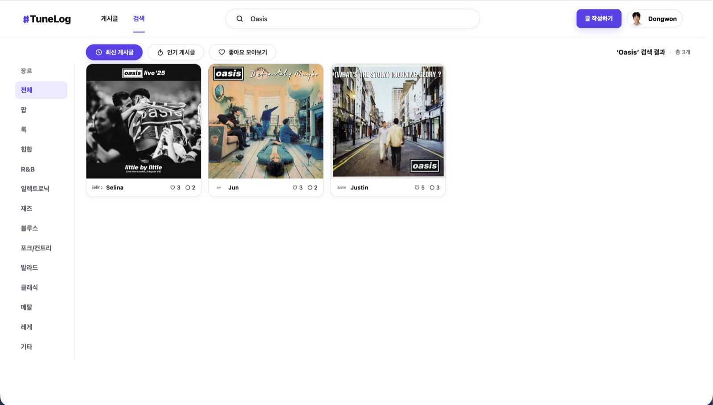</td>
    <td>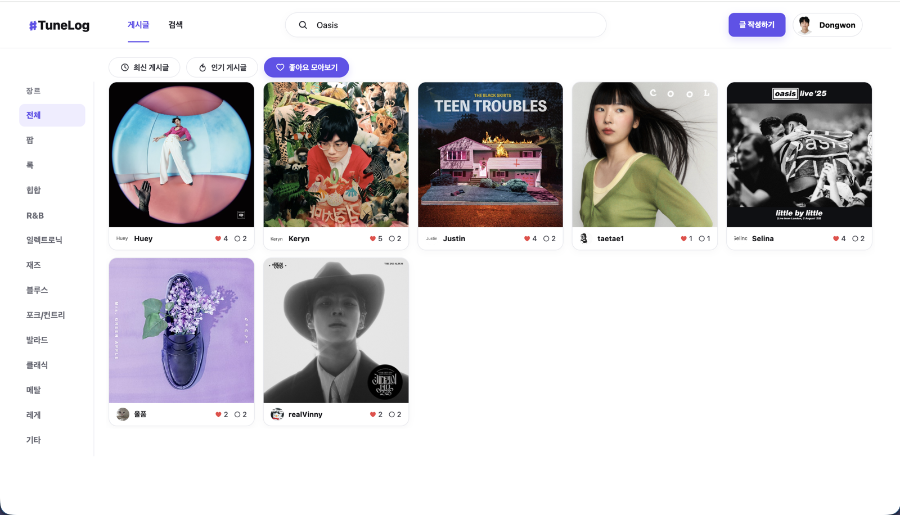</td>
  </tr>
  <tr>
    <td align="center"><sub>검색 조건과 결과 건수를 표시하고 일치하는 게시글을 제공합니다.</sub></td>
    <td align="center"><sub>사용자가 좋아요를 누른 게시글만 모아서 확인합니다.</sub></td>
  </tr>
</table>

### 게시글과 댓글

<table>
  <tr>
    <td align="center"><strong>게시글 상세</strong></td>
    <td align="center"><strong>댓글</strong></td>
  </tr>
  <tr>
    <td>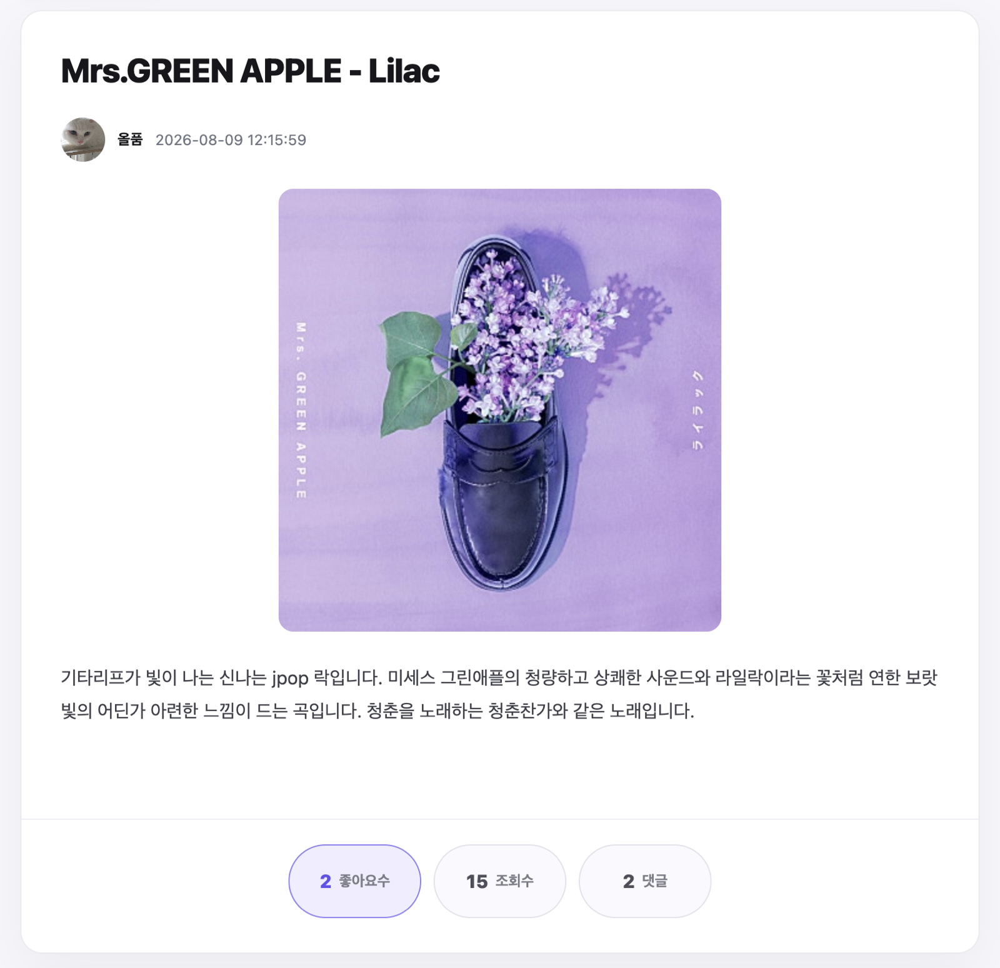</td>
    <td>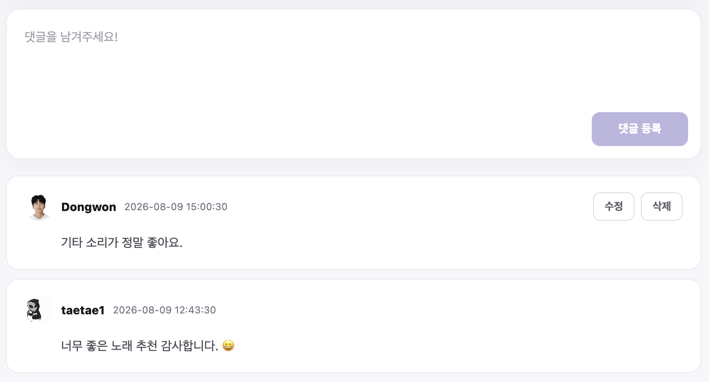</td>
  </tr>
  <tr>
    <td align="center"><sub>음악 이미지와 감상평, 좋아요·조회수·댓글 수를 확인합니다.</sub></td>
    <td align="center"><sub>게시글에 댓글을 작성하고 본인의 댓글을 수정·삭제합니다.</sub></td>
  </tr>
  <tr>
    <td align="center"><strong>게시글 작성</strong></td>
    <td align="center"><strong>게시글 수정</strong></td>
  </tr>
  <tr>
    <td>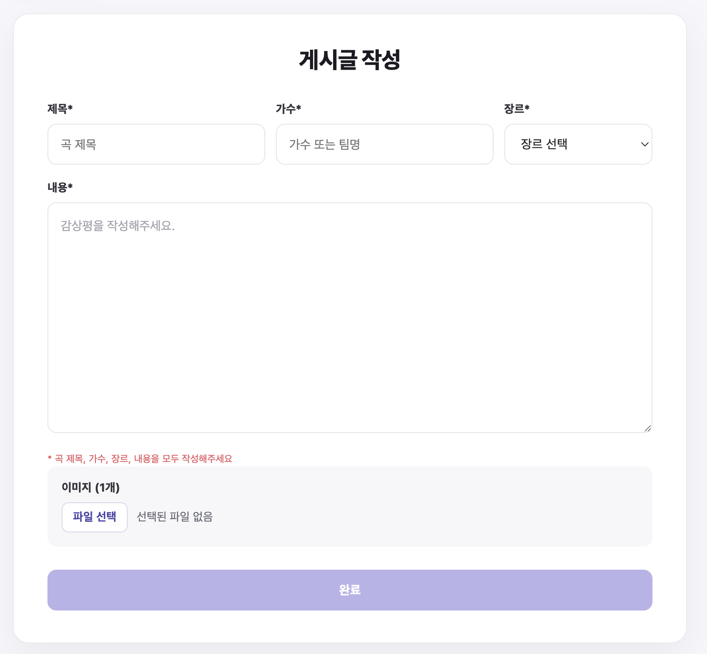</td>
    <td>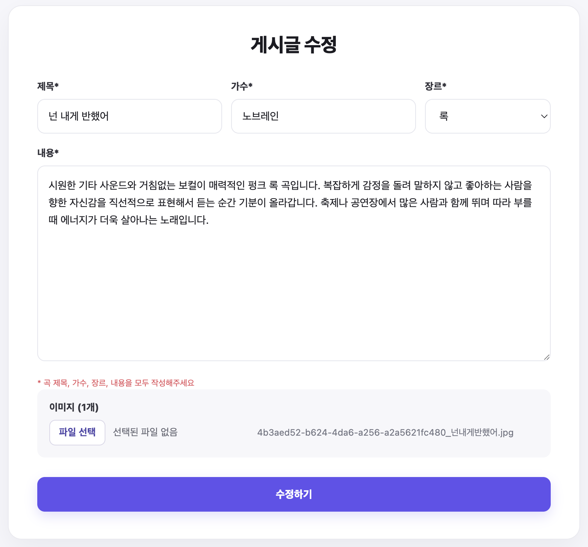</td>
  </tr>
  <tr>
    <td align="center"><sub>곡명·가수·장르·감상평과 이미지를 등록합니다.</sub></td>
    <td align="center"><sub>작성한 게시글의 음악 정보와 감상평을 수정합니다.</sub></td>
  </tr>
</table>

### 인증과 회원정보

<table>
  <tr>
    <td align="center"><strong>회원가입</strong></td>
    <td align="center"><strong>로그인</strong></td>
  </tr>
  <tr>
    <td>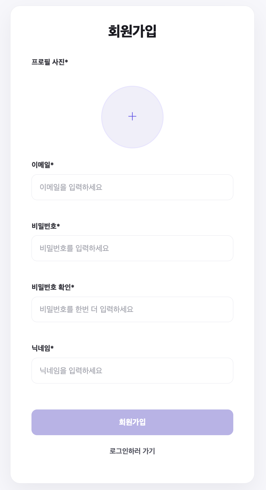</td>
    <td>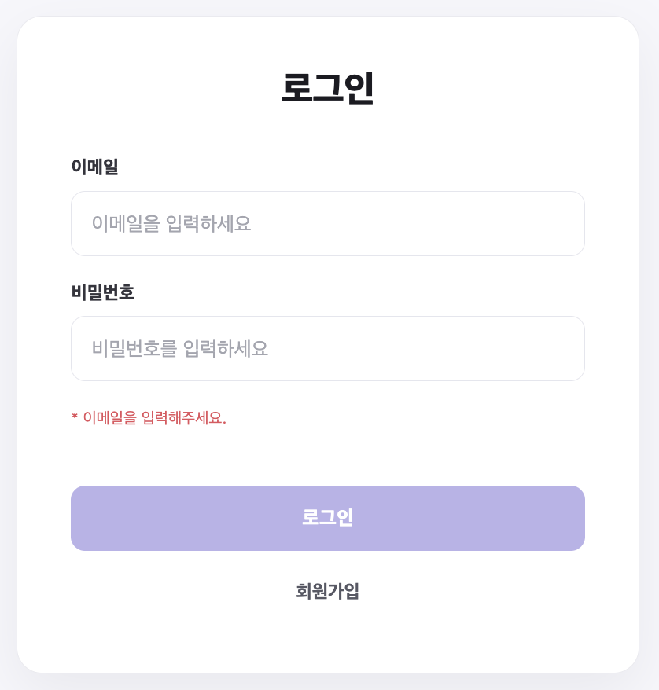</td>
  </tr>
  <tr>
    <td align="center"><sub>프로필 이미지와 계정 정보를 입력해 가입합니다.</sub></td>
    <td align="center"><sub>이메일과 비밀번호로 로그인합니다.</sub></td>
  </tr>
  <tr>
    <td align="center"><strong>회원정보 수정</strong></td>
    <td align="center"><strong>비밀번호 수정</strong></td>
  </tr>
  <tr>
    <td>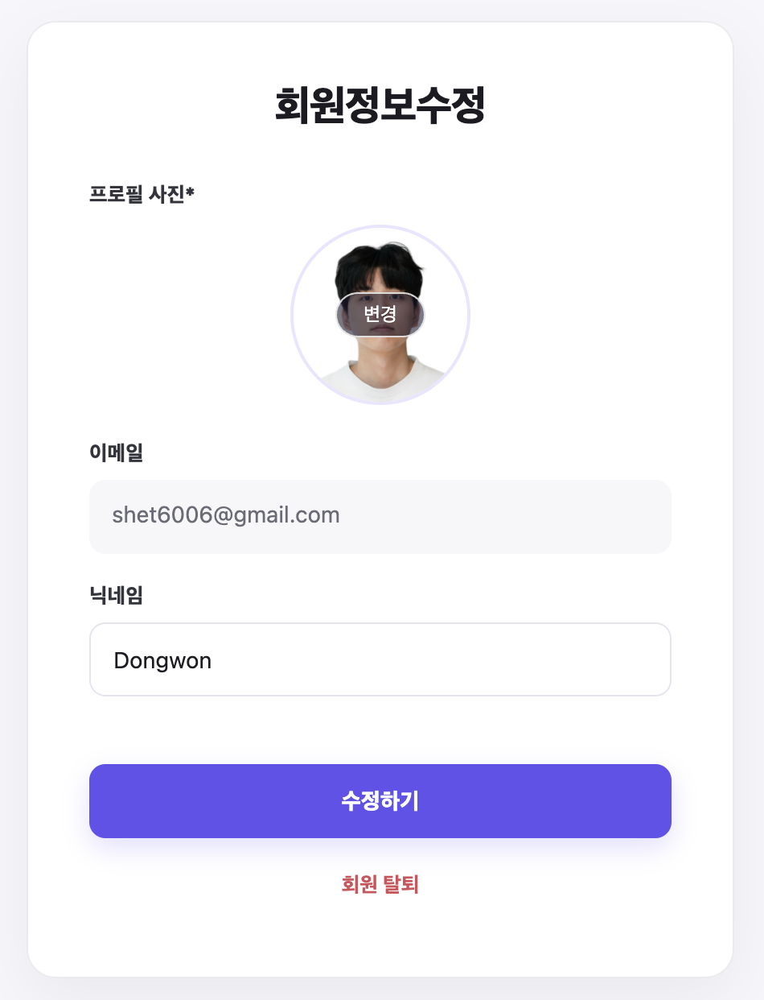</td>
    <td>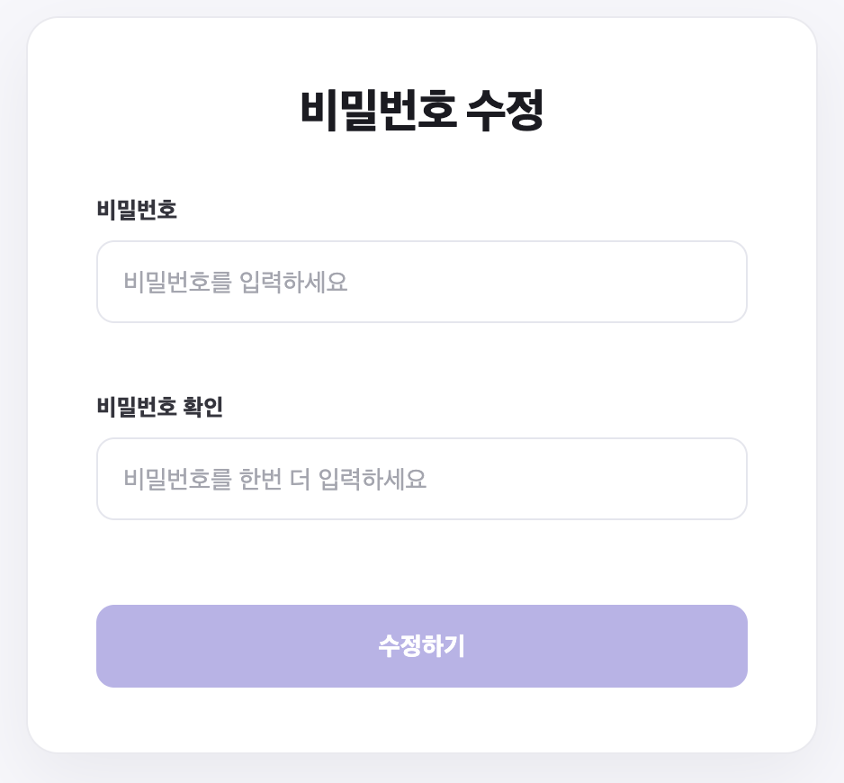</td>
  </tr>
  <tr>
    <td align="center"><sub>프로필 이미지와 닉네임을 변경하거나 회원 탈퇴를 진행합니다.</sub></td>
    <td align="center"><sub>검증 조건에 맞는 새로운 비밀번호로 변경합니다.</sub></td>
  </tr>
</table>

## 시연 영상

<p align="center">
  <a href="https://drive.google.com/file/d/1RCCscrPbMBL4bMINNszDyFZxYorLtDQ5/view?usp=sharing">
    
  </a>
</p>

<p align="center">
  <a href="https://drive.google.com/file/d/1RCCscrPbMBL4bMINNszDyFZxYorLtDQ5/view?usp=sharing">▶ 미리보기를 클릭해 전체 시연 영상 보기</a>
</p>


## 폴더 구조

<details>
<summary>폴더 구조 보기/숨기기</summary>

```text
.
├── .github
│   └── workflows
│       └── deploy-image.yml
├── public
├── src
│   ├── app
│   │   ├── App.jsx
│   │   └── router.jsx
│   ├── assets
│   ├── components
│   │   ├── comment
│   │   ├── common
│   │   ├── header
│   │   └── post
│   ├── contexts
│   ├── hooks
│   ├── layouts
│   ├── pages
│   ├── services
│   ├── styles
│   └── utils
├── Dockerfile
├── nginx.conf
├── package.json
└── vite.config.js
```

</details>

## 로컬 실행

### 요구 사항

- Node.js 22 이상
- 실행 중인 TuneLog Backend (`http://localhost:8080`)

### 환경변수

프로젝트 루트에 `.env.local`을 생성합니다.

```env
API_BASE_URL=http://localhost:8080
```

### 실행 명령

```bash
npm ci
npm run dev
```

개발 서버는 기본적으로 `http://localhost:5173`에서 실행됩니다.

```bash
npm run lint
npm run build
```

## 배포

Frontend Dockerfile은 멀티스테이지 빌드를 사용합니다.

```text
Node.js 이미지에서 의존성 설치와 React 빌드
→ dist 생성
→ Nginx 이미지에 dist와 nginx.conf 복사
→ 정적 파일을 제공하는 최종 이미지 생성
```

`main` 브랜치에 변경사항이 반영되면 GitHub Actions가 다음 작업을 수행합니다.

```text
소스코드 Checkout
→ Docker Buildx로 linux/amd64 이미지 빌드
→ GHCR에 latest·commit SHA 태그 Push
→ EC2 Self-hosted Runner에서 이미지 Pull
→ Docker Compose로 Frontend 컨테이너 교체
→ HTTP 응답 확인
```
## 회고
원하는 기능을 자유롭게 개발하는 것보다 정해진 요구사항을 해석하고 구현하는 과정이 훨씬 어렵다는 것을 체감했습니다. 단순히 화면을 만드는 것을 넘어, 백엔드 API가 어떤 데이터를 주고받는지에 따라 상태와 화면 구조를 설계해야 했습니다.

특히 기존 Vanilla JS 프로젝트를 React로 마이그레이션하면서 상태를 새롭게 설계하고 기존 구현을 전반적으로 변경해야 했습니다. 처음부터 다시 만드는 것처럼 느껴져 막막한 순간도 여러 번 있었지만, 그 과정에서 문제를 구조적으로 바라보고 사고하는 습관을 기를 수 있었습니다. 또한 변경 이유와 작업 과정을 정리하면서 자연스럽게 문서화와 형상 관리의 중요성도 체감했습니다.

게시글 목록과 댓글에 서버 페이지네이션을 적용하면서 데이터를 언제, 어떤 범위까지 다시 불러와야 하는지도 고민했습니다. 댓글이나 좋아요를 변경할 때 전체 게시글을 다시 조회하지 않고 필요한 상태만 갱신하도록 개선했고, 이를 통해 불필요한 API 요청과 화면 깜빡임을 줄여 사용자 경험을 향상시킬 수 있었습니다.
